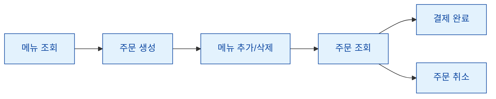

# ☕ Cafe Order Kiosk CLI

카페 메뉴를 조회하고, 주문을 생성하고, 결제까지 진행할 수 있는 간단한 Python CLI 키오스크입니다.  
터미널 환경에서 실제 키오스크의 기본 주문 흐름을 작게 구현한 프로젝트입니다.

## 🧾 Overview

Cafe Order Kiosk CLI는 카페 주문 과정을 명령어 기반으로 처리하는 미니 주문 시스템입니다.

사용자는 메뉴를 확인하고, 새 주문을 생성한 뒤, 원하는 메뉴를 주문에 추가하거나 삭제할 수 있습니다.  
주문 내용을 확인한 후 결제를 완료하거나, 필요하면 주문을 취소할 수 있습니다.

현재는 인메모리 저장소를 사용하며, 향후 파일 저장, 메뉴 관리, 할인/쿠폰, 옵션 가격 계산 등으로 확장할 수 있습니다.



## ✨ Features

- 메뉴 목록 조회
- 주문 생성 및 선택
- 주문 항목 추가
- 주문 항목 삭제
- 현재 주문 조회
- 주문 취소
- 결제 처리
- 주문 목록 조회
- 인메모리 기반 주문 관리

## 🚀 Quick Start

키오스크 CLI를 실행합니다.

```bash
python -m cafe_order_kiosk
```

실행 후 `키오스크>` 프롬프트에서 명령어를 입력합니다.

```text
키오스크> 메뉴
키오스크> 주문 생성
키오스크> 주문 추가 1 2
키오스크> 주문 조회
키오스크> 결제 카드
```

## 🧭 Commands

| Command                                  | Description                                |
| ---------------------------------------- | ------------------------------------------ |
| `메뉴`                                   | 카페 메뉴 목록을 조회합니다.               |
| `주문 생성 [메모]`                       | 새 주문을 생성합니다.                      |
| `주문 선택 <주문_id>`                    | 기존 주문을 현재 주문으로 선택합니다.      |
| `주문 추가 <메뉴_id> <수량> [옵션]`      | 현재 주문에 메뉴를 추가합니다.             |
| `주문 삭제 <라인번호>`                   | 현재 주문에서 특정 주문 항목을 삭제합니다. |
| `주문 조회`                              | 현재 주문 내용을 조회합니다.               |
| `주문 취소`                              | 현재 주문을 취소합니다.                    |
| `주문목록 목록 [진행중\|결제완료\|취소]` | 주문 목록을 조회합니다.                    |
| `결제 <방법> [금액]`                     | 현재 주문을 결제 완료 처리합니다.          |
| `도움말`                                 | 사용 가능한 명령어를 출력합니다.           |
| `종료`                                   | 프로그램을 종료합니다.                     |

가격과 금액은 원 단위 정수로 처리합니다.

## ✅ Test

테스트는 다음 명령어로 실행합니다.

```bash
pytest -q
```

## 📁 Project Structure

```text
cafe_order_kiosk/
├─ cli.py        # CLI 루프 및 명령 처리
├─ main.py       # 실행 진입점
├─ models.py     # 주문, 메뉴, 결제 모델
├─ kiosk_store.py    # 인메모리 저장소
└─ utils.py      # 명령어 파싱 등 작은 유틸리티
```

## 🗺️ Roadmap

Cafe Order Kiosk CLI는 기본적인 주문 흐름을 구현한 상태입니다.  
더 실제 키오스크에 가까운 시스템으로 발전하기 위해 다음 기능들이 필요합니다.

- 메뉴 추가, 수정, 삭제를 위한 관리자 명령
- 사이즈, 샷 추가, 얼음 양 같은 옵션 처리
- 옵션별 추가 금액 계산
- 할인 쿠폰과 포인트 적립
- 주문 내역 파일 저장
- 주문 영수증 출력
- 잘못된 입력에 대한 더 친절한 에러 메시지
- 결제 금액 검증 로직 강화
- 테스트 케이스 보강

## 🤝 Help Wanted

이 프로젝트는 더 완성도 높은 CLI 키오스크로 발전하기 위한 기여를 기다리고 있습니다.

작은 개선도 충분히 의미 있습니다.  
오타 수정, 출력 메시지 개선, 명령어 설명 보강처럼 작은 PR부터 메뉴 관리, 옵션 가격 계산, 파일 저장 같은 기능 확장까지 모두 환영합니다.

특히 아래 작업에 대한 기여가 필요합니다.

- 🧾 영수증 출력 기능 추가
- 🧊 메뉴 옵션과 추가 금액 처리
- 🎟️ 할인 쿠폰 기능 구현
- 💾 주문 내역 파일 저장
- 🛠️ 에러 메시지 개선
- 🧪 CLI와 주문 로직 테스트 보강
- 📚 README와 명령어 문서 개선

새로운 아이디어가 있다면 이슈로 제안하거나 PR로 직접 구현해 주세요.  
작은 개선이 쌓이면 이 프로젝트를 더 자연스럽고 실용적인 키오스크 CLI로 만들 수 있습니다.
